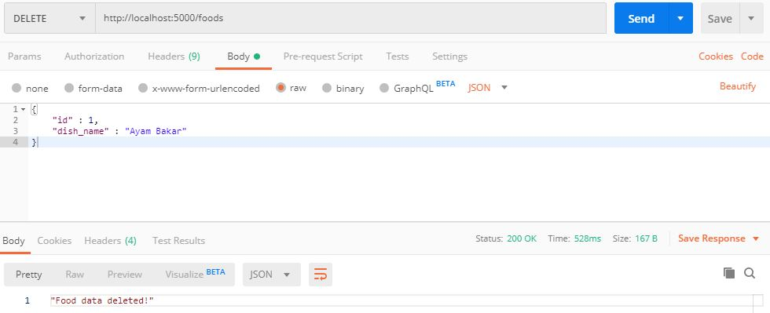

# Implementasi Basis Data Terdistribusi dengan TiDB
dengan basis data yang menerapkan sistem 3 layer (data layer, service layer, management layer).


## Skema Arsitektur 

- Penjelasan
    - Server DB
        1. Node 1 (PD Server)
            - OS    : CentOS 7
            - RAM   : 512 MB
            - CPUs  : 1
            - IP    : 192.168.16.64
        2. Node 2 (PD Server)
            - OS    : CentOS 7
            - RAM   : 512 MB
            - CPUs  : 1
            - IP    : 192.168.16.65
        3. Node 3 (PD Server)
            - OS    : CentOS 7
            - RAM   : 512 MB
            - CPUs  : 1
            - IP    : 192.168.16.66
        4. Node 4 (TiKV)
            - OS    : CentOS 7
            - RAM   : 512 MB
            - CPUs  : 1
            - IP    : 192.168.16.67
        5. Node 5 (TiKV)
            - OS    : CentOS 7
            - RAM   : 512 MB
            - CPUs  : 1
            - IP    : 192.168.16.68
        6. Node 6 (TiKV)
            - OS    : CentOS 7
            - RAM   : 512 MB
            - CPUs  : 1
            - IP    : 192.168.16.69

## Deployment

Prerequisite: 
- Download tarball TiDB pada websitenya.
- Menambahkan plugin `vbguest` pada Vagrant (jika belum)
```
vagrant plugin install vagrant-vbguest
```

Melakukan proses deploy dan provisioning dengan Vagrant

`Vagrantfile`
```
# -*- mode: ruby -*-
# vi: set ft=ruby :

Vagrant.configure("2") do |config|
    (1..6).each do |i|
      config.vm.define "node#{i}" do |node|
        node.vm.hostname = "node#{i}"

        # Gunakan CentOS 7 dari geerlingguy yang sudah dilengkapi VirtualBox Guest Addition
        node.vm.box = "geerlingguy/centos7"
        node.vm.box_version = "1.2.19"
        
        # Disable checking VirtualBox Guest Addition agar tidak compile ulang setiap restart
        node.vbguest.auto_update = false
        
        node.vm.network "private_network", ip: "192.168.16.#{64+i-1}"
        
        node.vm.provider "virtualbox" do |vb|
          vb.name = "node#{i}"
          vb.gui = false
          vb.memory = "512"
          vb.cpus = 1
        end
  
        node.vm.provision "shell", path: "./provision/bootstrap.sh", privileged: false
      end
    end
  end
```

Menyediakan script provisioning `provision/bootstrap.sh`

```
# Referensi:
# https://pingcap.com/docs/stable/how-to/deploy/from-tarball/testing-environment/

# Update the repositories
# sudo yum update -y

# Copy open files limit configuration
sudo cp /vagrant/config/tidb.conf /etc/security/limits.d/

# Enable max open file
sudo sysctl -w fs.file-max=1000000

# Copy atau download TiDB binary dari http://download.pingcap.org/tidb-v3.0-linux-amd64.tar.gz
cp /vagrant/installer/tidb-v3.0-linux-amd64.tar.gz .

# Extract TiDB binary
tar -xzf tidb-v3.0-linux-amd64.tar.gz

# Install MariaDB to get MySQL client
sudo yum -y install mariadb

# Install Git
sudo yum -y install git

# Install nano text editor
sudo yum -y install nano
```

## Konfigurasi TiDB pada Node

Pada bagian ini, dilakukan konfigurasi terhadap masing-masing node sesuai dengan role node tersebut pada klaster.

Karena proses ini merupakan proses untuk menjalankan TiDB cluster, sebaiknya disimpan pada masing-masing node sebagai file bash dan di run setiap kali node di start.

- Node 1 (PD Server 1)
```
cd tidb-v3.0-linux-amd64
./bin/pd-server --name=pd1 \
                --data-dir=pd \
                --client-urls="http://192.168.16.64:2379" \
                --peer-urls="http://192.168.16.64:2380" \
                --initial-cluster="pd1=http://192.168.16.64:2380,pd2=http://192.168.16.65:2380,pd3=http://192.168.16.66:2380" \
                --log-file=pd.log &
```
- Node 2 (PD Server 2)
```
cd tidb-v3.0-linux-amd64
./bin/pd-server --name=pd2 \
                --data-dir=pd \
                --client-urls="http://192.168.16.65:2379" \
                --peer-urls="http://192.168.16.65:2380" \
                --initial-cluster="pd1=http://192.168.16.64:2380,pd2=http://192.168.16.65:2380,pd3=http://192.168.16.66:2380" \
                --log-file=pd.log &
```
- Node 3 (PD Server 3)
```
cd tidb-v3.0-linux-amd64
./bin/pd-server --name=pd3 \
                --data-dir=pd \
                --client-urls="http://192.168.16.66:2379" \
                --peer-urls="http://192.168.16.66:2380" \
                --initial-cluster="pd1=http://192.168.16.64:2380,pd2=http://192.168.16.65:2380,pd3=http://192.168.16.66:2380" \
                --log-file=pd.log &
```
- Node 4 (TiKV Server 1)
```
cd tidb-v3.0-linux-amd64
./bin/tikv-server --pd="192.168.16.64:2379,192.168.16.65:2379,192.168.16.66:2379" \
                  --addr="192.168.16.67:20160" \
                  --data-dir=tikv \
                  --log-file=tikv.log &
```
- Node 5 (TiKV Server 2)
```
cd tidb-v3.0-linux-amd64
./bin/tikv-server --pd="192.168.16.64:2379,192.168.16.65:2379,192.168.16.66:2379" \
                  --addr="192.168.16.68:20160" \
                  --data-dir=tikv \
                  --log-file=tikv.log &
```
- Node 6 (TiKV Server 3)
```
cd tidb-v3.0-linux-amd64
./bin/tikv-server --pd="192.168.16.64:2379,192.168.16.65:2379,192.168.16.66:2379" \
                  --addr="192.168.16.69:20160" \
                  --data-dir=tikv \
                  --log-file=tikv.log &
```

Setelah semua PD dan TiKV terkonfig, jalankan kode berikut pada Node 1
```
cd tidb-v3.0-linux-amd64
./bin/tidb-server --store=tikv \
                  --path="192.168.16.64:2379" \
                  --log-file=tidb.log &
```

## Pemanfaatan Basis Data Terdistribusi dari Aplikasi

Aplikasi yang digunakan adalah REST API Katalog Makanan dengan Python Flask.
- app = `api/main.py`
- db = `food_catalogue.sql`

### Screenshoot CRUD Aplikasi

Mendapatkan list katalog makanan


Memasukkan data makanan baru


Mengubah data makanan di basis data


Menghapus data makanan


## Uji Performa

### Simulasi Fail-over

Cek kondisi klaster dan rolenya melalui endpoint server pada `192.168.16.64:2379/pd/api/v1/members`.


Uji fail-over dilakukan dengan mematikan node `leader` pada klaster. Pada kasus ini, node `leader` terletak pada `pd1`.
```
vagrant halt node1
```
Karena `node1` dimatikan, maka pengecekan klaster dapat dilakukan dari `pd` server lain. Pada kasus ini, pengecekan dilakukan pada `192.168.16.65:2379/pd/api/v1/members`.


Pada gambar, `pd` server leader berubah menjadi node 2. Dengan ini, uji fail-over telah berhasil dilakukan.

### Uji Performa Aplikasi dengan JMeter

Pengujian dilakukan dengan melakukan pengiriman HTTP request ke endpoint aplikasi, pada kasus ini adalah `127.0.0.1:5000/foods`. Endpoint tersebut akan menampilkan katalog makanan pada basis data.

- 100 koneksi


- 500 koneksi


- 1000 koneksi


### Uji Performa Basis Data dengan Sysbench

Uji coba dilakukan dengan menggunakan sysbench pada host dengan WSL. Langkah instalasi adalah sebagai berikut
```
# Sysbench
curl -s https://packagecloud.io/install/repositories/akopytov/sysbench/script.deb.sh | sudo bash    
sudo apt -y install sysbench

# Benchmark pada TiDB
git clone https://github.com/pingcap/tidb-bench.git
cd tidb-bench/sysbench
```

Kemudian ganti file `config` menyesuaikan dengan yang akan diuji. Pengujian dapat disiapkan dengan `./run.sh point_select prepare 100` dan dapat di run dengan `./run.sh point_select run 100`.

Hasil uji coba dengan Sysbench adalah sebagai berikut

- 3 PD Server


- 2 PD Server


- 1 PD Server
Pada pengujian 1 PD Server, TiDB mengeluarkan warning dengan error 'context deadline exceeded'

Dapat disimpulkan bahwa semakin sedikit jumlah PD server, proses eksekusi kueri menjadi lebih lama.

## Monitoring Basis Data

### Instalasi Node Exporter
Melakukan instalasi node exporter dengan menjalankan command berikut pada setiap Node.
```
wget https://github.com/prometheus/node_exporter/releases/download/v0.18.1/node_exporter-0.18.1.linux-amd64.tar.gz
tar -xzf node_exporter-0.18.1.linux-amd64.tar.gz

cd node_exporter-0.18.1.linux-amd64
./node_exporter --web.listen-address=":9100" \
    --log.level="info" &
    
```

### Instalasi Prometheus dan Grafana
Melakukan instalasi pada Node 1
```
wget https://github.com/prometheus/prometheus/releases/download/v2.2.1/prometheus-2.2.1.linux-amd64.tar.gz
wget https://dl.grafana.com/oss/release/grafana-6.5.1.linux-amd64.tar.gz

tar -xzf prometheus-2.2.1.linux-amd64.tar.gz
tar -xzf grafana-6.5.1.linux-amd64.tar.gz
```

### Konfigurasi Prometheus

`prometheus.yml`
```
global:
  scrape_interval: 15s  # By default, scrape targets every 15 seconds.
  evaluation_interval: 15s  # By default, scrape targets every 15 seconds.
  # scrape_timeout is set to the global default value (10s).
  external_labels:
    cluster: 'test-cluster'
    monitor: "prometheus"

scrape_configs:
  - job_name: 'overwritten-nodes'
    honor_labels: true  # Do not overwrite job & instance labels.
    static_configs:
    - targets:
      - '192.168.16.64:9100'
      - '192.168.16.65:9100'
      - '192.168.16.66:9100'
      - '192.168.16.67:9100'
      - '192.168.16.68:9100'
      - '192.168.16.69:9100'

  - job_name: 'tidb'
    honor_labels: true  # Do not overwrite job & instance labels.
    static_configs:
    - targets:
      - '192.168.16.64:10080'

  - job_name: 'pd'
    honor_labels: true  # Do not overwrite job & instance labels.
    static_configs:
    - targets:
      - '192.168.16.64:2379'
      - '192.168.16.65:2379'
      - '192.168.16.66:2379'

  - job_name: 'tikv'
    honor_labels: true  # Do not overwrite job & instance labels.
    static_configs:
    - targets:
      - '192.168.16.67:20180'
      - '192.168.16.68:20180'
      - '192.168.16.69:20180'
```

### Start Prometheus Service

```
./prometheus \
    --config.file="./prometheus.yml" \
    --web.listen-address=":9090" \
    --web.external-url="http://192.168.16.64:9090/" \
    --web.enable-admin-api \
    --log.level="info" \
    --storage.tsdb.path="./data.metrics" \
    --storage.tsdb.retention="15d" &
```

### Start Grafana pada Node 

`conf/grafana.ini`
```
[paths]
data = ./data
logs = ./data/log
plugins = ./data/plugins
[server]
http_port = 3000
domain = 192.168.16.64
[database]
[session]
[analytics]
check_for_updates = true
[security]
admin_user = admin
admin_password = admin
[snapshots]
[users]
[auth.anonymous]
[auth.basic]
[auth.ldap]
[smtp]
[emails]
[log]
mode = file
[log.console]
[log.file]
level = info
format = text
[log.syslog]
[event_publisher]
[dashboards.json]
enabled = false
path = ./data/dashboards
[metrics]
[grafana_net]
url = https://grafana.net
```

Start grafana service
```
./bin/grafana-server \
    --config="./conf/grafana.ini" &
```

### Konfigurasi Grafana

Login ke Grafana Web Interface dengan Default address: `http://192.168.16.64:3000`, default account & password = `admin`

Tambahkan data source berupa prometheus dengan URL sesuai dengan prometheus service pada node 1.

### Menambahkan Grafana Dashboard

Memilih dashboard pada `https://github.com/pingcap/tidb-ansible/tree/master/scripts`.
Pada percobaan ini, dashboard yang digunakan yaitu `pd.json`, `tidb.json`, dan `tikv_details.json`.

