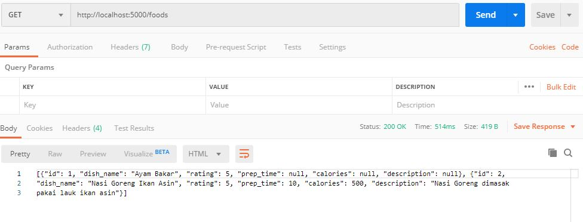

# Implementasi Basis Data Terdistribusi dengan TiDB
dengan basis data yang menerapkan sistem 3 layer (data layer, service layer, management layer).


## Skema Arsitektur 

- Penjelasan
    - Server DB
        1. Node 1 (PD Server)
            - OS    : CentOS 7
            - RAM   : 512 MB
            - CPUs  : 1
            - IP    : 192.168.16.64
        2. Node 2 (PD Server)
            - OS    : CentOS 7
            - RAM   : 512 MB
            - CPUs  : 1
            - IP    : 192.168.16.65
        3. Node 3 (PD Server)
            - OS    : CentOS 7
            - RAM   : 512 MB
            - CPUs  : 1
            - IP    : 192.168.16.66
        4. Node 4 (TiKV)
            - OS    : CentOS 7
            - RAM   : 512 MB
            - CPUs  : 1
            - IP    : 192.168.16.67
        5. Node 5 (TiKV)
            - OS    : CentOS 7
            - RAM   : 512 MB
            - CPUs  : 1
            - IP    : 192.168.16.68
        6. Node 6 (TiKV)
            - OS    : CentOS 7
            - RAM   : 512 MB
            - CPUs  : 1
            - IP    : 192.168.16.69

## Deployment

Prerequisite: 
- Download tarball TiDB pada websitenya.
- Menambahkan plugin `vbguest` pada Vagrant (jika belum)
```
vagrant plugin install vagrant-vbguest
```

Melakukan proses deploy dan provisioning dengan Vagrant

`Vagrantfile`
```
# -*- mode: ruby -*-
# vi: set ft=ruby :

Vagrant.configure("2") do |config|
    (1..6).each do |i|
      config.vm.define "node#{i}" do |node|
        node.vm.hostname = "node#{i}"

        # Gunakan CentOS 7 dari geerlingguy yang sudah dilengkapi VirtualBox Guest Addition
        node.vm.box = "geerlingguy/centos7"
        node.vm.box_version = "1.2.19"
        
        # Disable checking VirtualBox Guest Addition agar tidak compile ulang setiap restart
        node.vbguest.auto_update = false
        
        node.vm.network "private_network", ip: "192.168.16.#{64+i-1}"
        
        node.vm.provider "virtualbox" do |vb|
          vb.name = "node#{i}"
          vb.gui = false
          vb.memory = "512"
          vb.cpus = 1
        end
  
        node.vm.provision "shell", path: "./provision/bootstrap.sh", privileged: false
      end
    end
  end
```

Menyediakan script provisioning `provision/bootstrap.sh`

```
# Referensi:
# https://pingcap.com/docs/stable/how-to/deploy/from-tarball/testing-environment/

# Update the repositories
# sudo yum update -y

# Copy open files limit configuration
sudo cp /vagrant/config/tidb.conf /etc/security/limits.d/

# Enable max open file
sudo sysctl -w fs.file-max=1000000

# Copy atau download TiDB binary dari http://download.pingcap.org/tidb-v3.0-linux-amd64.tar.gz
cp /vagrant/installer/tidb-v3.0-linux-amd64.tar.gz .

# Extract TiDB binary
tar -xzf tidb-v3.0-linux-amd64.tar.gz

# Install MariaDB to get MySQL client
sudo yum -y install mariadb

# Install Git
sudo yum -y install git

# Install nano text editor
sudo yum -y install nano
```

## Konfigurasi TiDB pada Node

Pada bagian ini, dilakukan konfigurasi terhadap masing-masing node sesuai dengan role node tersebut pada klaster.

Perintah-perintah dibawah dieksekusi dengan aktif direktori di tidb
```
cd tidb-v3.0-linux-amd64
```

- Node 1 (PD Server 1)
```
./bin/pd-server --name=pd1 \
                --data-dir=pd \
                --client-urls="http://192.168.16.64:2379" \
                --peer-urls="http://192.168.16.64:2380" \
                --initial-cluster="pd1=http://192.168.16.64:2380,pd2=http://192.168.16.65:2380,pd3=http://192.168.16.66:2380" \
                --log-file=pd.log &
```
- Node 2 (PD Server 2)
```
./bin/pd-server --name=pd2 \
                --data-dir=pd \
                --client-urls="http://192.168.16.65:2379" \
                --peer-urls="http://192.168.16.65:2380" \
                --initial-cluster="pd1=http://192.168.16.64:2380,pd2=http://192.168.16.65:2380,pd3=http://192.168.16.66:2380" \
                --log-file=pd.log &
```
- Node 3 (PD Server 3)
```
./bin/pd-server --name=pd3 \
                --data-dir=pd \
                --client-urls="http://192.168.16.66:2379" \
                --peer-urls="http://192.168.16.66:2380" \
                --initial-cluster="pd1=http://192.168.16.64:2380,pd2=http://192.168.16.65:2380,pd3=http://192.168.16.66:2380" \
                --log-file=pd.log &
```
- Node 4 (TiKV Server 1)
```
./bin/tikv-server --pd="192.168.16.64:2379,192.168.16.65:2379,192.168.16.66:2379" \
                  --addr="192.168.16.67:20160" \
                  --data-dir=tikv \
                  --log-file=tikv.log &
```
- Node 5 (TiKV Server 2)
```
./bin/tikv-server --pd="192.168.16.64:2379,192.168.16.65:2379,192.168.16.66:2379" \
                  --addr="192.168.16.68:20160" \
                  --data-dir=tikv \
                  --log-file=tikv.log &
```
- Node 6 (TiKV Server 3)
```
cd tidb-v3.0-linux-amd64
./bin/tikv-server --pd="192.168.16.64:2379,192.168.16.65:2379,192.168.16.66:2379" \
                  --addr="192.168.16.69:20160" \
                  --data-dir=tikv \
                  --log-file=tikv.log &
```

Setelah semua PD dan TiKV terkonfig, jalankan kode berikut pada Node 1
```
./bin/tidb-server --store=tikv \
                  --path="192.168.16.64:2379" \
                  --log-file=tidb.log &
```

## Pemanfaatan Basis Data Terdistribusi dari Aplikasi

Aplikasi yang digunakan adalah REST API Katalog Makanan dengan Python Flask.
- app = `api/main.py`
- db = `food_catalogue.sql`

### Screenshoot CRUD Aplikasi

Mendapatkan list katalog makanan


Memasukkan data makanan baru


Mengubah data makanan di basis data


Menghapus data makanan


## Uji Performa

### Simulasi Fail-over

Cek kondisi klaster dan rolenya melalui endpoint server pada `192.168.16.64:2379/pd/api/v1/members`.


Uji fail-over dilakukan dengan mematikan node `leader` pada klaster. Pada kasus ini, node `leader` terletak pada `pd1`.
```
vagrant halt node1
```
Karena `node1` dimatikan, maka pengecekan klaster dapat dilakukan dari `pd` server lain. Pada kasus ini, pengecekan dilakukan pada `192.168.16.65:2379/pd/api/v1/members`.


Pada gambar, `pd` server leader berubah menjadi node 2. Dengan ini, uji fail-over telah berhasil dilakukan.