# Infrastruktur Basis Data Terdistribusi dengan Skema Replikasi Multi-Master

#### Vinsensius Indra Suryanto 05111640000064

## Table of Contents
- [Infrastruktur Basis Data Terdistribusi dengan Skema Replikasi Multi-Master](#infrastruktur-basis-data-terdistribusi-dengan-skema-replikasi-multi-master)
  - [Table of Contents](#table-of-contents)
  - [Desain dan Implementasi Infrastruktur](#desain-dan-implementasi-infrastruktur)
  - [Penggunaan Basis Data Terdistribusi dalam Aplikasi](#penggunaan-basis-data-terdistribusi-dalam-aplikasi)
  - [Simulasi fail-over](#simulasi-fail-over)

## Desain dan Implementasi Infrastruktur

### Desain infrastruktur basis data terdistribusi & load balancing

- Skema Infrastruktur

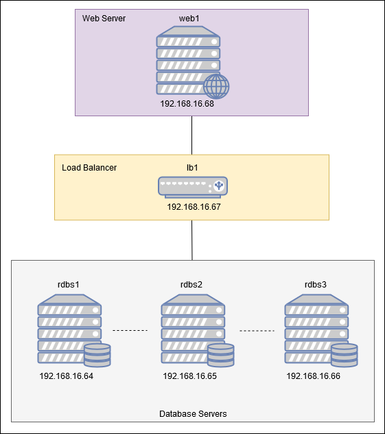

- Penjelasan
    - Server DB
        1. rdbs1 (MySQL)
            - OS    : Ubuntu 18.04.3 LTS
            - RAM   : 512 MB
            - CPUs  : 1
            - IP    : 192.168.16.64
        2. rdbs2 (MySQL)
            - OS    : Ubuntu 18.04.3 LTS
            - RAM   : 512 MB
            - CPUs  : 1
            - IP    : 192.168.16.65
        3. rdbs3 (MySQL)
            - OS    : Ubuntu 18.04.3 LTS
            - RAM   : 512 MB
            - CPUs  : 1
            - IP    : 192.168.16.66
    - Load Balancer
        1. lb1 (ProxySQL)
            - OS    : Ubuntu 18.04.3 LTS
            - RAM   : 512 MB
            - CPUs  : 1
            - IP    : 192.168.16.67
    - Web Server
        1. web1 (apache2)
            - OS    : Ubuntu 18.04.3 LTS
            - RAM   : 512 MB
            - CPUs  : 1
            - IP    : 192.168.16.68

### Implementasi infrastruktur basis data terdistribusi
#### 1. Setup Percona XtraDB Cluster
#### Menggunakan Vagrant untuk deployment dan provisioning DB Server ke Virtualbox

```
# Config for Relational DB Servers (3)
  (1..3).each do |i|
    config.vm.define "rdbs#{i}" do |node|
      node.vm.hostname = "rdbs#{i}"
      node.vm.box = "ubuntu/bionic64"
      node.vm.network "private_network", ip: "192.168.16.6#{i+3}"
      
      node.vm.provider "virtualbox" do |vb|
        vb.name = "rdbs#{i}"
        vb.gui = false
        vb.memory = "512"
        vb.cpus = "1"
      end
      
      node.vm.provision "shell", path: "bootstrapRDBS#{i}.sh"
    end
  end
```

#### Setup awal melalui provisioning script
```
# Update Packages
apt-get update

# Upgrade Packages
apt-get upgrade

# Remove apparmor so PXC can work properly
apt-get remove -y apparmor

# Add Percona Repo
wget https://repo.percona.com/apt/percona-release_latest.generic_all.deb
dpkg -i percona-release_latest.generic_all.deb
percona-release setup pxc57
apt-get update
```
#### Instalasi Percona XtraDB Cluster

<strong>NOTE: Pastikan akses terhadap Node adalah `root`.</strong>
```
$ apt-get install -y percona-xtradb-cluster-57
```
Akan muncul perintah untuk memasukkan password root, kosongkan, dan pilih OK.

#### Stop MySQL service
```
$ service mysql stop
```
#### Menambahkan variabel konfigurasi pada file `/etc/mysql/my.cnf`
```
# Add configuration variables
cat >>/etc/mysql/my.cnf<<EOF
[mysqld]
wsrep_provider=/usr/lib/libgalera_smm.so
wsrep_cluster_name=pxc-cluster
wsrep_cluster_address=gcomm://192.168.16.64,192.168.16.65,192.168.16.66
wsrep_node_name=pxc1
wsrep_node_address=192.168.16.64
wsrep_sst_method=xtrabackup-v2
wsrep_sst_auth=sstuser:passw0rd
pxc_strict_mode=ENFORCING
binlog_format=ROW
default_storage_engine=InnoDB
innodb_autoinc_lock_mode=2
EOF
```
Ubah beberapa line di atas pada Node 2 dan Node 3 sesuai dengan nama dan IP masing-masing.
#### Node 2
```
wsrep_node_name=pxc2
wsrep_node_address=192.168.16.65
```
#### Node 3
```
wsrep_node_name=pxc3
wsrep_node_address=192.168.16.66
```
#### Melakukan Bootstrap Percona XtraDB Cluster pada Node 1
```
$ /etc/init.d/mysql bootstrap-pxc
```
Jika berhasil, maka akan muncul line bootstrap pxc.

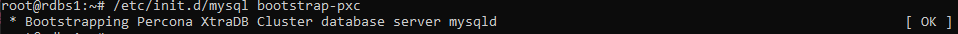

#### Tambahkan user SST dan hak aksesnya pada Node 1
User SST dibuat untuk melakukan state transfer
```
$ mysql -u root -padmin < /vagrant/sstuser.sql
```
#### Jalankan Service MySQL pada Node 2 & 3 untuk join cluster
```
$ /etc/init.d/mysql start
```
Akhir dari setup Percona XtraDB Cluster pada rdbs1, rdbs2, rdbs3

#### 2. Setup ProxySQL
#### Setup awal melalui provisioning script
```
# Update Packages
apt-get update

# Upgrade Packages
apt-get upgrade

# Remove apparmor so PXC can work properly
apt-get remove -y apparmor

# Add Percona Repo
wget https://repo.percona.com/apt/percona-release_latest.generic_all.deb
dpkg -i percona-release_latest.generic_all.deb
percona-release setup pxc57
apt-get update
```
#### Instalasi Percona XtraDB Cluster

<strong>NOTE: Pastikan akses terhadap Node adalah `root`.</strong>
```
$ apt-get install -y percona-xtradb-cluster-57
```
Akan muncul perintah untuk memasukkan password root, kosongkan, dan pilih OK.

#### Stop MySQL service
```
$ service mysql stop
```

#### Install ProxySQL
```
$ apt-get install proxysql2
```

#### Tambahkan konfigurasi ProxySQL
```
$ mysql -u admin -padmin -h 127.0.0.1 -P 6032 < /vagrant/proxysqlquery.sql
```
Akhir dari setup ProxySQL


## Penggunaan Basis Data Terdistribusi dalam Aplikasi

### Instalasi Web Server

#### Menggunakan Vagrant untuk deployment dan provisioning Web Server ke Virtualbox
```
# Config for web server
config.vm.define "web1" do |node|
  node.vm.hostname = "web1"
  node.vm.box = "ubuntu/bionic64"
  node.vm.network "private_network", ip: "192.168.16.68"
  
  node.vm.provider "virtualbox" do |vb|
    vb.name = "web1"
    vb.gui = false
    vb.memory = "512"
    vb.cpus = "1"
  end

  node.vm.provision "shell", path: "bootstrapWebServer.sh"
end
```

#### Script Provisioning
`bootstrapWebServer.sh`
```
# Update Packages
apt-get update

# Upgrade Packages
apt-get upgrade

# Apache
apt-get install -y apache2

# Enable Apache Mods
a2enmod rewrite

#Add Ondrej PPA Repo
apt-add-repository ppa:ondrej/php
apt-get update

deb http://ppa.launchpad.net/ondrej/php/ubuntu bionic main
deb-src http://ppa.launchpad.net/ondrej/php/ubuntu bionic main

# Install PHP
apt-get install -y php7.3

# PHP Mods
apt-get install -y php7.3 libapache2-mod-php7.3 php7.3-cli php7.3-mysql php7.3-gd php7.3-imagick php7.3-recode php7.3-tidy php7.3-xmlrpc php7.3-common php7.3-curl php7.3-mbstring php7.3-xml php7.3-bcmath php7.3-bz2 php7.3-intl php7.3-json php7.3-readline php7.3-zip

# Restart Apache
systemctl restart apache2
```

### Aplikasi yang digunakan 

#### Penjelasan Aplikasi
Aplikasi yang digunakan adalah aplikasi platform Capture the Flag (CTF) berbasis PHP.

#### Memasukkan Aplikasi ke Web Server
Aplikasi disematkan ke dalam web server dengan melakukan copy terhadap kode sumber aplikasi dari `/vagrant` ke `/var/www/html/`
```
$ cp /vagrant/ctfweb /var/www/html/
```

#### Membuat database untuk Aplikasi
Dilakukan dengan menjalankan kueri pada salah satu node DB yang tergabung dalam cluster. Pada kasus ini, kueri disimpan di sql dump pada file `database.php`
```
$ mysql < /vagrant/ctfweb/database.php
```

#### Konfigurasi Koneksi Aplikasi ke DB
`db.php`
```
<?php

$host = "192.168.16.67";
$username = "sbuser";
$password = "sbpass";
$dbname = "lolctf";

// Create connection
$con = new mysqli($host, $username, $password, $dbname, 6033);

// Check connection
if ($con->connect_error) {
  die("Connection failed: " . $con->connect_error);
}

?>
```
Aplikasi menggunakan host dengan alamat Load balancer ProxySQL, sebagai pintu untuk melakukan akses DB.

#### Screenshoot Aplikasi
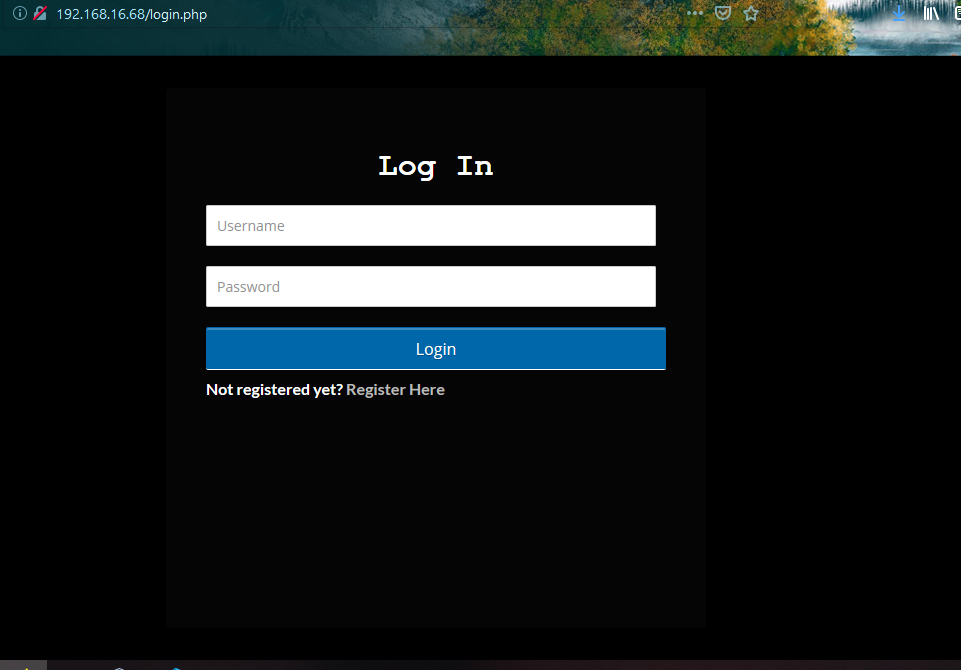

Login page dari <strong>ctfweb</strong> berhasil diakses di browser host.

## Simulasi fail-over

Langkah pertama untuk melakukan uji coba, yaitu dengan memastikan semua node telah hidup / online.
```
$ vagrant status
```
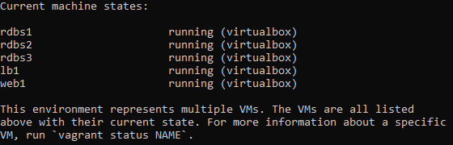

#### Uji coba dengan kasus penggunaan menambahkan problem ke dalam problem set

Halaman awal problem set, terisi dengan 2 problem.

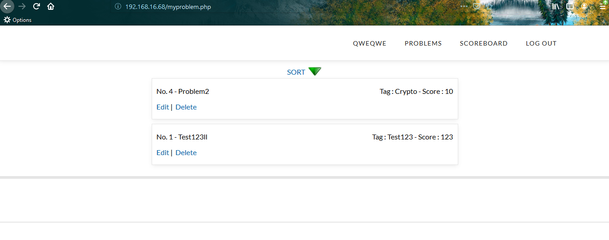

Data pada RDBS1:

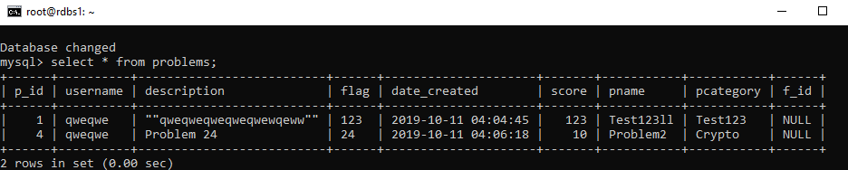

Kemudian melakukan failover pada server DB 1 dan 2
```
root@rdbs2:~# service mysql stop

root@rdbs1:~# service mysql bootstrap-stop
```
Pengecekan failover di node ProxySQL:

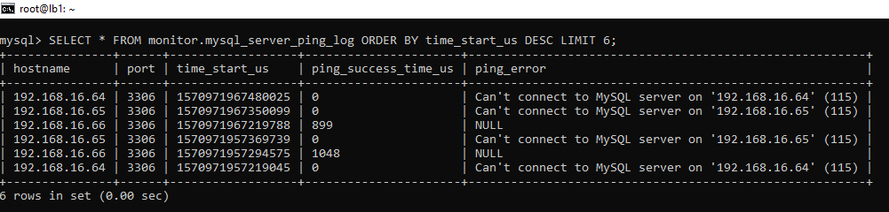

Pada gambar diatas, Node DB 1 (192.168.16.64) dan 2 (192.168.16.65) tidak bisa di-ping oleh ProxySQL, hanya node 3 (192.168.16.66) yang statusnya masih aktif.

Mencoba menambahkan data pada web saat failover:

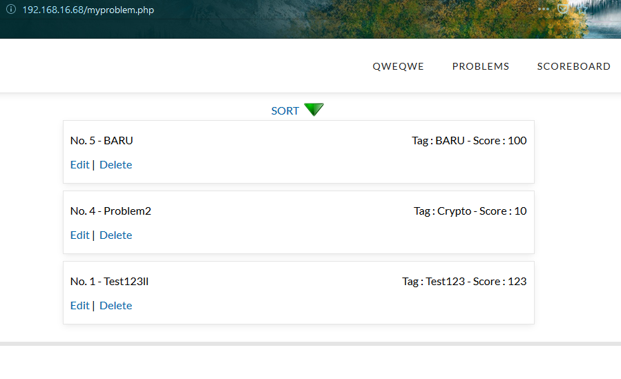

Mengecek DB Node 3:

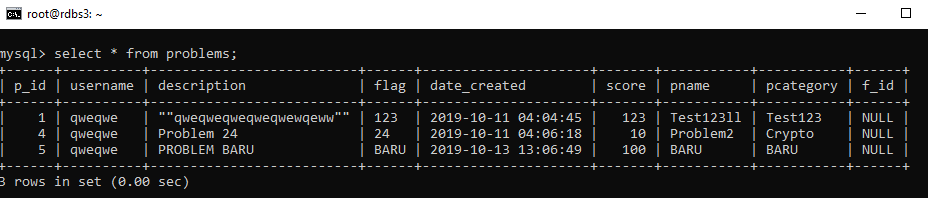

Mengaktifkan kembali Server DB node 1 dan 2:
```
root@rdbs2:~# service mysql start

root@rdbs1:~# service mysql start
root@rdbs1:~# service mysql bootstrap-pxc
```
Mengecek DB Node 1 dan 2:

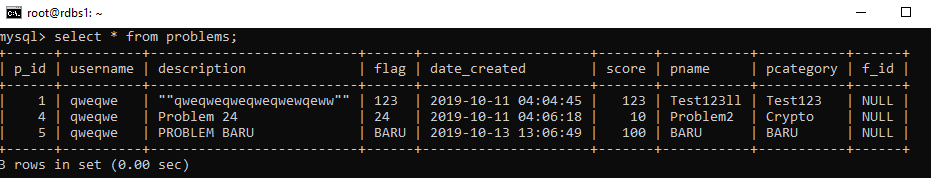

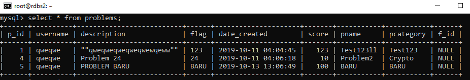

Pada gambar, terbukti cluster dapat melakukan sync data kembali setelah terjadi failover pada node lain.